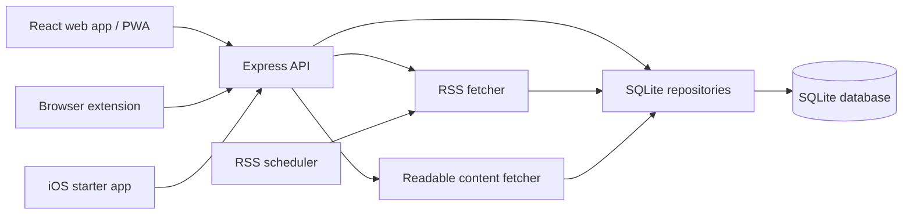

# Architecture

Kunai is organized around a small set of clear boundaries: shared contracts, an Express API, SQLite repositories, feed/content fetchers, and a React client.

## Component Diagram

## Server

The server entry point is `server/src/index.ts`.

Responsibilities:

- load environment configuration
- apply SQLite migrations
- configure Express middleware
- expose the HTTP API
- serve the production client build
- run an initial feed refresh on startup
- start the recurring RSS scheduler

The server uses `zod` to validate request payloads at route boundaries. Most persistent work is delegated to repository modules under `server/src/db/`.

Current review notes:

- Route handlers and middleware all live in `server/src/index.ts`; this is workable today but is becoming a large coordination point.
- Some endpoints validate bodies with `zod`, while path/query parameters and settings updates are less consistently validated.
- `cors()` is enabled without an origin allowlist, so browser callers from any origin can reach the API when the service is exposed.

## Database Layer

`server/src/db/client.ts` opens `DATA_DIR/rssreader.sqlite`, creates the data directory if needed, enables WAL mode, and turns on foreign key support.

Repository modules:

- `repository.ts` handles feeds and items.
- `folders.ts` handles folder CRUD and ordering.
- `tags.ts` handles tag CRUD and merging.
- `settings.ts` handles key/value settings conversion.
- `migrations.ts` loads numbered SQL migrations and applies pending migrations using `PRAGMA user_version`.

## Feed Refresh

`server/src/rss/fetcher.ts` uses `rss-parser` to fetch and normalize feeds. It:

- skips disabled feeds
- normalizes links by removing common tracking parameters and fragments
- chooses a stable deduplication key from GUID, ID, normalized link, or raw link
- extracts likely image URLs from enclosures, media fields, Open Graph fields, or embedded HTML
- sanitizes snippets and content
- inserts new items with `INSERT OR IGNORE`
- records feed fetch status and errors

`server/src/rss/scheduler.ts` refreshes all feeds on an interval. The interval comes from the `refreshMinutes` setting when present, otherwise `REFRESH_INTERVAL_MINUTES`.

The scheduler also periodically applies retention cleanup for read, unsaved articles when `articleRetention` is set.

Refresh behavior is sequential per feed. This keeps load predictable but means one slow feed can delay later feeds during a refresh cycle. The client also calls refresh while the document is visible, currently on a fixed five-minute interval.

## Readable Content Fetching

`server/src/content/fetcher.ts` fetches an article URL, parses the HTML with JSDOM, extracts the primary article using Mozilla Readability, sanitizes the result, and returns safe HTML.

The HTTP endpoint is disabled unless `CONTENT_FETCH_ENABLED` is enabled at the server environment level. The UI can still expose the button, but the server is the source of truth for whether content fetch is allowed.

Because content fetching dereferences article URLs from feed items, production deployments should treat it as an outbound-request feature that needs URL policy, timeout, size, and private-network protections before exposing Kunai beyond a trusted network.

## Client

The client entry point is `client/src/main.tsx`, with primary app state in `client/src/App.tsx`.

Client responsibilities:

- load feeds, folders, tags, settings, items, and saved items
- manage selected feed/folder/tag/search state
- persist local view preferences with `usePersistedState`
- render list, card, and magazine views
- optimistically update read, saved, folder, feed, and tag changes
- open item modals and fetch readable content on demand

HTTP access is centralized in `client/src/api.ts`.

The main app component owns most application state and orchestration. That makes cross-view behavior easy to follow in one file, but it is now a refactor candidate as feed, folder, tag, settings, saved-item, and modal behavior continue to grow.

## Companion Surfaces

The browser extensions call `GET /api/feeds`, sum unread counts, display a badge, and open the configured Kunai base URL. They do not share TypeScript contracts with the web app and currently request broad host access to support arbitrary self-hosted Kunai URLs.

The iOS SwiftUI code is a starter client. It supports server URL configuration and basic feed/item fetching, but it does not yet cover the full web feature set or authentication.

## Shared Contracts

`shared/types.ts` defines the domain and request/response types used by both client and server. Update this file when API shapes change, then update the API implementation and client calls together.
